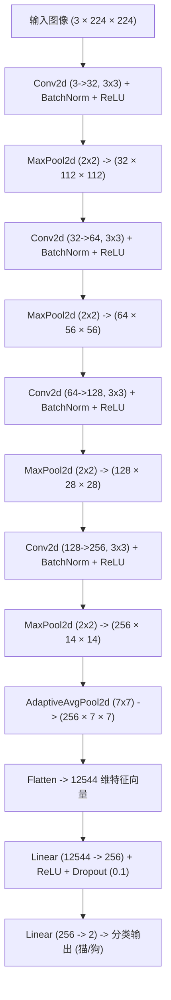

# 猫狗图像 CNN 分类器项目指南 (Project Guide)

本项目是一个基于 **PyTorch** 深度学习框架、从零（From Scratch）设计并训练的卷积神经网络（CNN）猫狗二分类图像分类系统。

通过自定义的 4 层 CNN 架构，结合批量归一化（Batch Normalization）、适度 Dropout 随机失活以及丰富的数据增强技术，项目在未加载任何预训练权重的情况下，在 Kaggle 经典猫狗测试集上达到了 **96.6% 的准确率**（V3 版本）。

---

## 📂 项目目录结构说明

项目的核心代码目录结构如下。你可以点击对应的文件名或目录链接直接跳转查看：

*   [CNN_cat_vs_dog/](file:///f:/PyProject/CNN_cat_vs_dog) - **项目根目录**
    *   📁 [data/](file:///f:/PyProject/CNN_cat_vs_dog/data) - 数据存放目录
        *   `猫狗分类图片.zip` - 原始数据集压缩包
        *   📁 `raw/` - 缩减版数据集目录（已划分好训练、验证与测试文件夹）
        *   📁 `raw_complate/` - 完整版数据集目录，包含 `PetImages` 原始结构（通过代码动态随机划分为 8:1:1）
    *   📁 [models/](file:///f:/PyProject/CNN_cat_vs_dog/models) - 模型权重存放目录
        *   `best_catdog_model.pth` - V1 版本最佳模型权重
        *   `best_catdog_model-v2.pth` - V2 版本最佳模型权重
        *   `best_catdog_model-v3.pth` - V3 版本最佳模型权重（当前最新）
    *   📁 [src/](file:///f:/PyProject/CNN_cat_vs_dog/src) - 源代码目录
        *   📁 [data/](file:///f:/PyProject/CNN_cat_vs_dog/src/data)
            *   [clean_data.py](file:///f:/PyProject/CNN_cat_vs_dog/src/data/clean_data.py) - 缩减版数据集的数据清洗与 DataLoader 封装
            *   [clean_data_2.py](file:///f:/PyProject/CNN_cat_vs_dog/src/data/clean_data_2.py) - 完整版新数据集的数据清洗、动态划分与 DataLoader 封装
        *   📁 [test/](file:///f:/PyProject/CNN_cat_vs_dog/src/test)
            *   [test.py](file:///f:/PyProject/CNN_cat_vs_dog/src/test/test.py) - 模型测试评估脚本
        *   [train_script.py](file:///f:/PyProject/CNN_cat_vs_dog/src/train_script.py) - 网络结构定义、模型训练与验证主循环
    *   `train_warnings.log` - 训练期间产生的各类警告和弃用提示日志（已自动重定向捕获至此，保持控制台终端整洁）
    *   [requirements.txt](file:///f:/PyProject/CNN_cat_vs_dog/requirements.txt) - Python 依赖包列表
    *   [READEME.md](file:///f:/PyProject/CNN_cat_vs_dog/READEME.md) - 原项目自述文件

---

## 🛠️ 技术栈与环境准备

### 1. 主要技术栈
*   **开发语言**：Python 3.10+
*   **深度学习框架**：PyTorch 2.6.0 (支持 CUDA 12.4 加速)
*   **图像处理**：torchvision, Pillow (PIL), OpenCV
*   **数据科学与可视化**：NumPy, pandas, matplotlib, scikit-learn

### 2. 环境安装
使用以下命令，在当前项目根目录下安装所有必要依赖：
```bash
pip install -r requirements.txt
```

---

## 💾 数据集准备规范

项目支持使用以下两种数据集组织形式进行训练与测试：

### 1. 缩减版数据集 (基于 `data/raw/`)
需要物理组织并提前划分好 `train/`, `val/`, `test/` 文件夹层次，每个文件夹下分为 `cat/` 和 `dog/` 文件夹。
> [!NOTE]
> `src/data/clean_data.py` 会直接读取物理目录下的子集。

### 2. 完整版数据集 (基于 `data/raw_complate/`)
直接解压 `data/猫狗分类图片.zip` 后获得的完整原始数据集。所有图片位于 `data/raw_complate/PetImages/Cat/` 和 `data/raw_complate/PetImages/Dog/` 中，文件结构如下：
```text
data/raw_complate/
└── PetImages/
    ├── Cat/          # 包含所有猫的图片 (12500张)
    └── Dog/          # 包含所有狗的图片 (12500张)
```

> [!TIP]
> **新机制 (推荐使用 `clean_data_2.py`)**：
> 1. **动态随机划分**：自动读取 `PetImages/` 原始结构，并在内存中按 **8:1:1** 的比例划分出训练、验证和测试子集。采用固定的随机种子 `42`，每次运行数据集切分保证完全一致。
> 2. **容错与坏图自愈功能 (`SafeDatasetWrapper`)**：官方完整数据集中存在若干损坏或非正常图片（如 `666.jpg`）。本机制采用自定义安全包裹器，在多进程 DataLoader 读取这些异常图片抛错时，会自动捕获异常并随机加载另一张正常图片替换，从而**保证高强度训练过程流畅不崩溃**。


---

## 🧠 卷积神经网络 (CNN) 架构设计

项目采用自定义的深度卷积神经网络，未使用 ImageNet 预训练，完全从零开始训练以拟合数据。具体架构如下：



### 关键优化策略：
1.  **数据增强（Data Augmentation）**：
    在 [clean_data.py](file:///f:/PyProject/CNN_cat_vs_dog/src/data/clean_data.py) 中，训练集图像经历了以下增强策略：
    *   **随机裁剪**：先 `Resize(256)`，再 `RandomCrop(224)`。
    *   **几何变换**：随机水平翻转 (`RandomHorizontalFlip`)，随机旋转最多 25 度 (`RandomRotation`)。
    *   **色彩抖动**：`ColorJitter` 调节亮度、对比度、饱和度及色调，从而抑制模型过拟合，提高泛化能力。
2.  **批归一化与失活（BatchNorm & Dropout 空间隔离与拟合释放）**：
    *   **架构定义**：在特征提取器（卷积层）部分引入 `BatchNorm2d` 稳定数据分布并加速收敛；在分类器部分，V2 曾完全关闭 Dropout（0.0）以释放模型拟合力，**V3 在模型已具备良好收敛基础后将其适度回调至 `0.1`**，进一步抑制过拟合。
    *   **调优结论**：经过多维超参数对比实验诊断，对于从头训练且无预训练的浅层网络，BatchNorm 与 Dropout 同时开启会产生极强的联合正则化约束（即强正则重叠），大大拉低了浅层网络在开始阶段对图像几何特征的学习效率，导致 Loss 在 0.693 锁死。因此 **V2 阶段将其关闭**以释放模型拟合力、保证模型快速正常起步；**V3 阶段在模型已充分收敛后重新引入小比例 Dropout（0.1）**，在不破坏收敛的前提下提升泛化性能。
3.  **学习率调度器（LR Scheduler）**：
    *   使用 Adam 优化器，初始学习率已调优下调至 **`0.0005`**。
    *   **V2 策略**：配合 `StepLR` 每 **15** 轮自动衰减为原来的 **`0.75`**。
    *   **V3 策略**：配合 `StepLR` 每 **25** 轮自动衰减为原来的 **`0.85`**（更温和的衰减节奏，配合更长的训练轮次，提升后期收敛精度）。
    *   **调优结论**：在 25,000 张图的完整数据集下，初始 0.0025 的高学习率容易导致 Adam 优化器在前几个 Batch 的大梯度下破坏模型初始权重空间。调整为 0.0005 能够保证高吞吐状态下极稳健地温和启动和精确拟合。
4.  **训练轮次调整（Epochs）**：
    *   V2 训练轮次为 **60 Epochs**；**V3 提升至 80 Epochs**，配合更温和的 StepLR 衰减节奏，在充分训练的同时避免过拟合。
5.  **高吞吐与 GPU 性能加速（I/O 深度优化）**：
    针对大样本量下可能出现的 I/O 瓶颈和 GPU 饥饿问题，在 [train_script.py](file:///f:/PyProject/CNN_cat_vs_dog/src/train_script.py) 中实施了以下系统级优化：
    *   **消除终端警告污染**：配置 Python `warnings` 日志重定向机制，将所有的 `FutureWarning` 以及 PIL 的 `UserWarning: Truncated File Read` 警告**自动捕获并写入到根目录下的 `train_warnings.log` 日志文件**，保持终端控制台清爽整洁。
    *   **移除 AMP 混合精度限制**：实验发现，在结构较浅且没有预训练的模型中，AMP 半精度 (FP16) 会导致部分梯度下溢，从而诱发 0.693 锁死。由于本模型参数量极小（仅 5.4M），使用标准单精度 (FP32) 训练能在保证绝对数值精度和收敛平滑度的同时，依然在 GPU 上保持极佳的迭代吞吐量。
    *   **内存锁页与异步拷贝**：在 [clean_data_2.py](file:///f:/PyProject/CNN_cat_vs_dog/src/data/clean_data_2.py) 数据读取端启用 `pin_memory=True`，在数据搬运端使用 `images.to(device, non_blocking=True)` 异步拷贝，使得 CPU 预处理与 GPU 网络前向传播异步流水线执行，解决 GPU 饥饿问题。
    *   **吞吐与多进程加速**：将 `batch_size` 设为 `64`，并将 `num_workers` 上调至 `4`，充分榨干 GPU 算力。
    *   **梯度清理优化**：执行 `optimizer.zero_grad(set_to_none=True)`，避免写零显存以加快梯度更新复位。

---

## 🚀 运行流程指南

### 1. 模型训练 (Training)
运行训练脚本 [train_script.py](file:///f:/PyProject/CNN_cat_vs_dog/src/train_script.py)，程序将在控制台输出每个 Epoch 的训练 Loss、验证集 Loss 以及当前验证集准确率。
```bash
cd src
python train_script.py
```
*   **训练轮次**：当前版本（V3）默认设为 80 Epochs。
*   **保存机制**：每当在验证集上获得更好的准确率时，最新的模型权重会自动更新保存到 `models/best_catdog_model-v3.pth`。

### 2. 模型测试 (Testing)
运行测试脚本 [test.py](file:///f:/PyProject/CNN_cat_vs_dog/src/test/test.py) 对测试集进行推理，评估模型在独立未见测试集上的性能。
```bash
cd src/test
python test.py
```
*   **权重载入**：默认加载 `models/best_catdog_model-v3.pth` 进行前向计算。

---

## 📈 模型评估指标

### 版本性能对比

| 指标 | V1/V2 | V3（当前） |
| :--- | :--- | :--- |
| **验证集最佳准确率** | 91.9% | **95.88%** |
| **测试集最终准确率** | 92.0% | **96.6%** |
| **测试集平均损失** | 0.2004 | **0.0904** |
| **训练集最终损失** | - | 0.1034 |
| **验证集最终损失** | - | 0.1095 |

### V2 → V3 关键优化变更

| 参数 | V2 | V3 |
| :--- | :--- | :--- |
| 训练轮次 (Epochs) | 60 | **80** |
| Dropout | 0.0（关闭） | **0.1** |
| StepLR step_size | 15 | **25** |
| StepLR gamma | 0.75 | **0.85** |
| 学习率 | 0.0005 | 0.0005（不变） |

---

## 🤝 致谢与贡献
*   数据集来源于 **ModelScope 魔塔社区**
*   项目调优及代码重构过程获得了 **DeepSeek** 技术支持。
